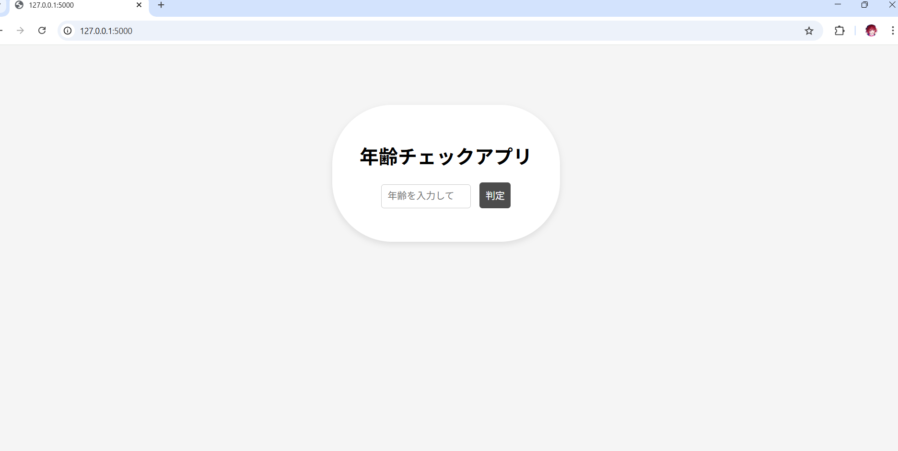
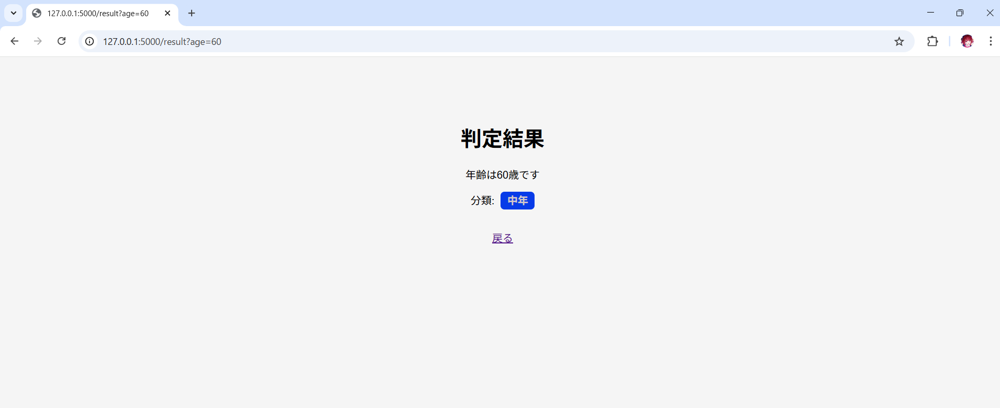

# 年齢チェックアプリ

Flask を使って作成したシンプルな Web アプリです。  
入力した年齢をもとに年齢カテゴリを判定して表示します。

## 使用技術

- Python
- Flask
- HTML
- CSS
- Jinja2

## 機能

- 年齢入力フォーム
- 年齢カテゴリの判定
- 入力値のバリデーション
- エラーメッセージ表示
- カテゴリごとの色付き表示

## 学習ポイント

このアプリでは以下を学習しました。

- Flask のルーティング
- POST リクエスト処理
- PRG（Post / Redirect / Get）パターン
- Jinja テンプレート
- HTML / CSS を使った UI 作成
- フォーム入力のバリデーション

## 今後の改善

- UI デザインの改善
- 年齢カテゴリの追加
- データベースの導入

## 動作イメージ

